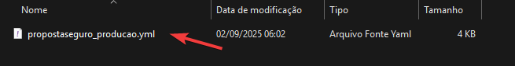
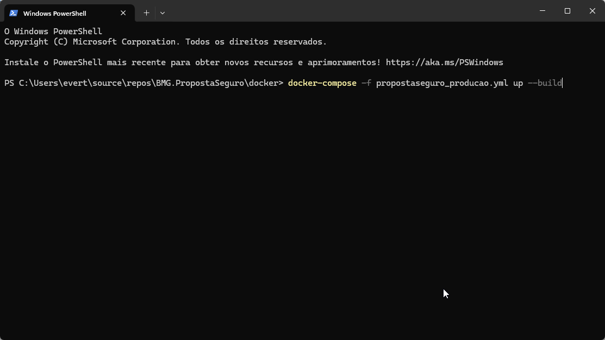

# BMG Propostas de Seguro Teste Técnico

## Tecnologias Usadas

- **.NET** 
- **SQL Server**
- **RabbitMQ**
- **Docker**
  
###  Instruções de build e execução

1) Acessar a pasta "docker" que está na raiz do projeto.

2) Abrir o terminal no respectivo local e exectuar o arquivo "arquivo-propostaseguro_producao" com o seguinte comando: 
**"docker-compose -f propostaseguro_producao.yml up --build"**

